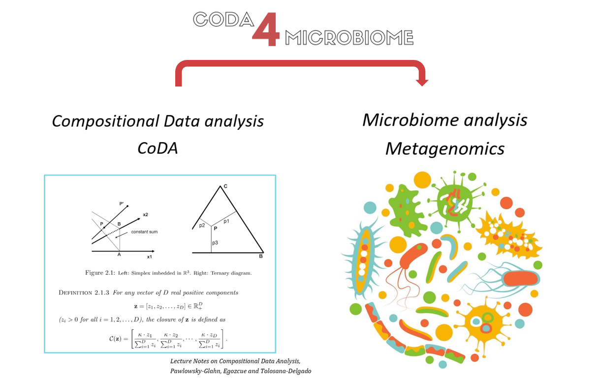
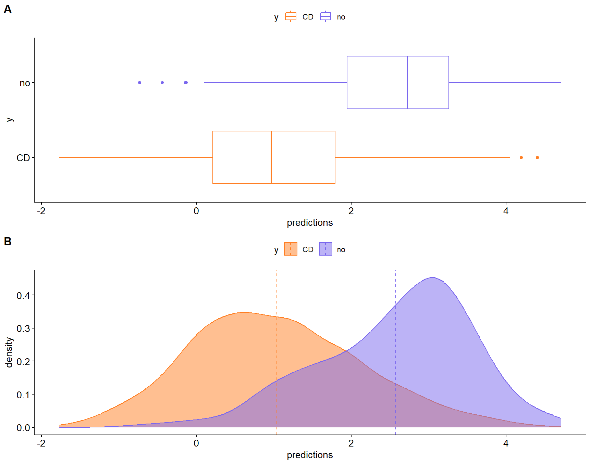
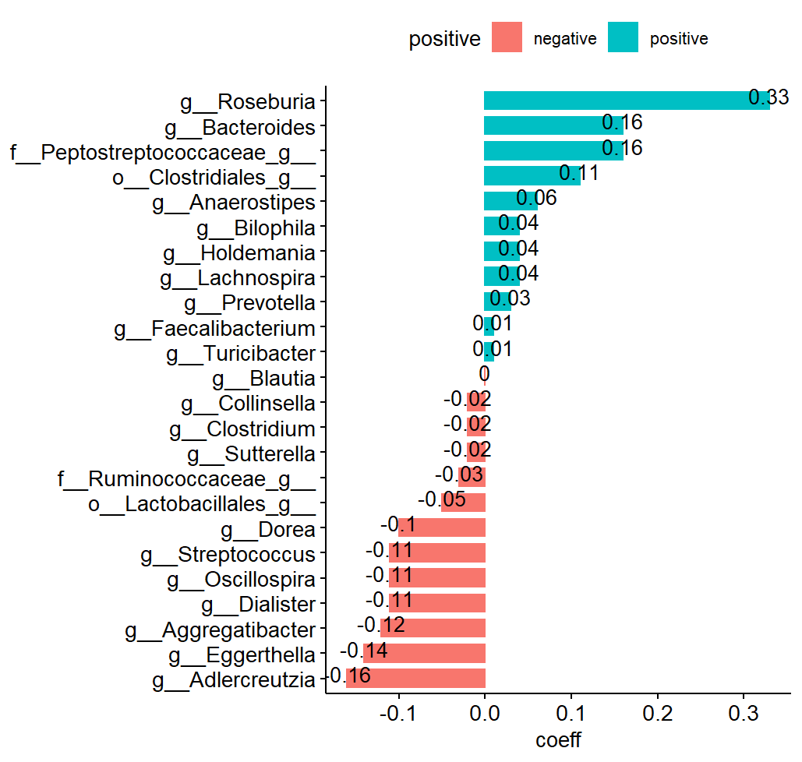
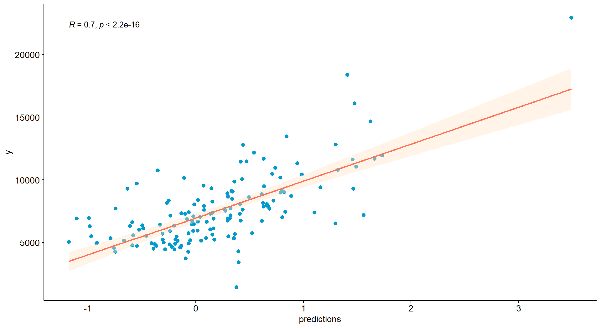
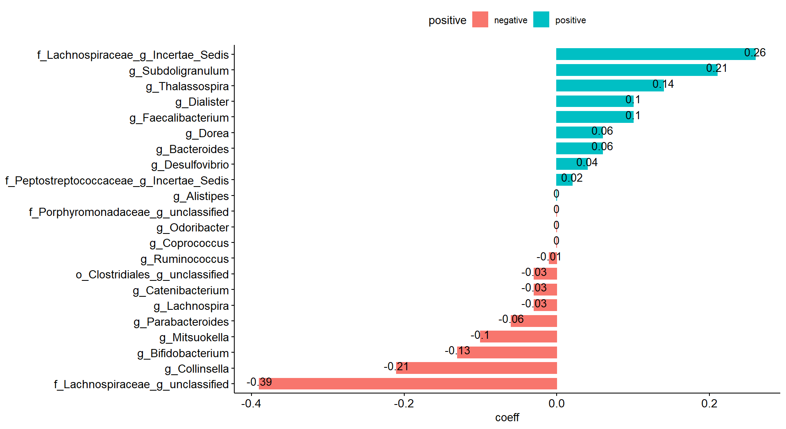

```{r, include = FALSE}
knitr::opts_chunk$set(
  collapse = TRUE,
  comment = "#>"
)
```


## Introduction
Human-associated microbial signatures are highly relevant for understanding the role of the microbiome in health and for their potential applications in personalized medicine. Their prediction accuracy relies on the selection of the features that constitute the signature, which is challenging given the sparsity, multivariate and **compositional** inherent characteristics of microbiome data. 

We say that a set of data is compositional if each value does not make sense in absolute terms, but they are related to each other in such a way that they are actually _percentages_ of each one over the total value of the sample.

The compositional structure of microbiome data is mainly due to three aspects: (1) microbial competition and interactions, (2) technical artefacts, such as DNA sequencing, and (3) data transformations (rarefaction, proportions). Not taken into account the compositional nature of a set of data can give a severe biass on the results (see our web page (__posar el link__) for more information).

We introduce a new package **coda4microbiome** that allows you to fill the gap between microbiome data and a proper interpretation of their compositional structure.



 


 <!-- ```{r setup} -->

## Package functionality

Our package provides you a set of functions to explore and study your microbiome data and obtain a selection of the most relevant microbial signatures associated with a phenotype of interest. 
Our method is based on the **glmnet** package but adapted to compositional data using the log-ratios of the variables. The coda4microbiome functions can be applied to both binary and continuous outcomes. The results give the signed weighted input of the most relevant variables in the data. Output plots are also provided to a better understanding of the variables relationship. 

In addition, the package incorporates a new treatment for **longitudinal microbiome studies**. You can see these longitudinal examples at the associated vignette.

### main functions

* **coda_glmnet**: fits the log-ratio model for compositional data. It also allows the use of covariant variables.

* **coda_glmnet_longitudinal**:Compositional analysis for longitudinal studies.
Identification of a set of microbial taxa whose joint dynamics is associated with the phenotype of interest.The algorithm performs variable selection through penalized regression over the summary of the log-ratio trajectories (AUC).

### suplementary functions

- **explore_zeros**: Given two columns of the abundance table x, it computes and plot the relative frequencies of zero data when comparing two columns.
Results can be stratified using outcome variable.

- **coda_glmnet_null**:bla,bla,bla,bla,bla,bla,bla,bla,bla,bla,bla,bla,bla,bla,bla,bla,bla,bla,bla,bla

- **explore_coda_longitudinal**:bla,bla,bla,bla,bla,bla,bla,bla,bla,bla,bla,bla,bla,bla,bla,bla,bla,bla,bla,bla

- **coda_glmnet_longitudinal_null**:bla,bla,bla,bla,bla,bla,bla,bla,bla,bla,bla,bla,bla,bla,bla,bla,bla,bla,bla,bla

## Cross-sectional Studies
We can apply the compositional analysis both for binary and continuous outcome data.

### Binary data
We choose the well known Chrohn data set (included in the data folder). The showPlots variable is changed to FALSE in order to export 

```{r  fig.width=5, fig.height=5, fig.fullwidth=TRUE}
library(coda4microbiome)
set.seed(123) # to reproduce the results
load("..\\data\\Crohn.rda")
coda_glmnet_Crohn<-coda_glmnet(x=x_Crohn,y=y_Crohn, showPlots = FALSE)
# results
coda_glmnet_Crohn$taxa.num
coda_glmnet_Crohn$taxa.name
coda_glmnet_Crohn$`log-contrast coefficients`
head(coda_glmnet_Crohn$`predictions`)
coda_glmnet_Crohn$`apparent AUC`
coda_glmnet_Crohn$`mean cv-AUC`
coda_glmnet_Crohn$`sd cv-AUC`
#coda_glmnet_Crohn$`predictions plot`
#coda_glmnet_Crohn$`signature plot`
```
{width=400px}
{width=400px}


### Continuous data

When the outcome variable is continuous we can also use the same _coda_glmnet_ funtion. As an example:

```{r  fig.width=5, fig.height=5, fig.fullwidth=TRUE}
library(coda4microbiome)
set.seed(123) # to reproduce the results
load("..\\data\\sCD14.rda")
x <- sCD14[,1:60]
y <- sCD14[,61]

coda_glmnet_SCD14<-coda_glmnet(x,y, lambda = "lambda.min", showPlots = FALSE)

coda_glmnet_SCD14$taxa.num
head(coda_glmnet_SCD14$taxa.name)
coda_glmnet_SCD14$`log-contrast coefficients`
coda_glmnet_SCD14$Rsq
#coda_glmnet_SCD14$`predictions plot`
#coda_glmnet_SCD14$`signature plot`
```
{width=500px}
{width=500px}
  
### Explore Data

coda4microbiome package, also offers you some tools to explore the data.
Using the _explore_zeros_ function you can see the incidence of zero data in your experiment file. 

You have to set the two columns you want to compare and also if you want stratified results.

```{r  fig.width=4, fig.height=4, fig.fullwidth=TRUE}
load("..\\data\\Crohn_data.rda")
x <- x_Crohn
x <- x-1 #recover zero values because they where previously imputed to 1 in this data set
y <- y_Crohn
idCol1 <- 1
idCol2 <- 2
out<- explore_zeros(x,idCol1,idCol2) #global zero frequencies
out<- explore_zeros(x,idCol1,idCol2, strata=y)
```

Another important tool is the _coda_glmnet_null_ function that allows you 

MALU:............

You have to set the number of iterations and variables. Optionally a covariant vector can be used. 

```{r  fig.width=4, fig.height=4, fig.fullwidth=TRUE}
load("..\\data\\HIV.rda")
x <- HIV[,1:60]
y <- HIV[,62]
z <- data.frame(MSM = HIV[,61])
null_acc<-coda_glmnet_null(x,y, niter=10, nvar=8, covar=z)
summary(null_acc$"accuracy")
null_acc$"confidence interval"
```
